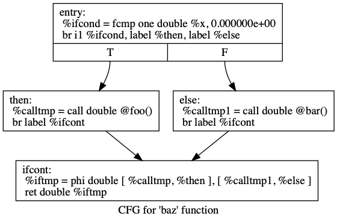

# 制御フロー

## はじめに
５章にようこそ．ここまでで，LLVM IRを出力したり，JITを実装したりしてきたが，`Kaleidoscope`自体は，まったく使い物にならないものだった．
それは，`Kaleidoscope`が，関数呼び出しと`return`以外に制御フローを持たないからである．
これは，条件分岐が実装できないことを意味しており，その能力を大きく制限するものである．
本章では，`Kaleidoscope`に，`if/then/else`表現と，`for`ループを追加する．

## `if/then/else`
`Kaleidoscope`が`if/then/else`をサポートするように拡張することは，率直にいって，当たり前の話である．
このためには，lexer，パーサ，抽象構文木，LLVMコードジェネレータに新しいコンセプトを追加しなければならない．
時間をかけながら，新しいアイデアを見つけながら，拡張し，言語を育てていくことがいかに簡単かを示す例として，この例は非常によい．

この拡張をどうやって加えるか，に取り掛かる前に，「何」が欲しいかについて議論する．基本的なアイデアは，以下のようなコードが書けるようになることである．

```
def fib(x)
  if x < 3 then
    1
  else
    fib(x-1)+fib(x-2);
```

`Kaleidoscope`では，`construct`は，すべて表現である．すなわち，`statement`は存在しない．
`if/then/else`のような表現は，ほかと同じように戻り値を必要とする．
我々がもっとも関数的な形式を使っているため，それを，その条件として評価させ,
`then`や，`else`の値を，その条件がどう解決されたかに基づいて返すようにする．
これは，C言語の三項演算子`?`表現にとてもよく似ている．

`if/then/else`のsemantics(適当な訳語がない)は，ブーリアンと同じ値である`0.0`を`false`として扱い，それ以外のすべての値を`true`として扱う．
最初の条件が`true`の場合，はじめのsubexpressionが評価され，返される．また，条件がfalseの場合，二番目のsubexpressionが評価され．返される．
`Keleidoscopse`は，副作用（関数型言語ではないということ）を許容するため，この振る舞いを突き詰めることは重要である．

さて，何が欲しいのかが明らかになたので，次は，これを要素にわけていこう．

### `if/then/else`のためのlexerの拡張
lexerの拡張は，愚直である．まず，新しい列挙子を追加する．

```
// control
tok_if = -6,
tok_then = -7,
tok_else = -8,
```

これらのトークンを認識するために，以下のように識別を追加する．

```
...
if (IdentifierStr == "def")
  return tok_def;
if (IdentifierStr == "extern")
  return tok_extern;
if (IdentifierStr == "if")
  return tok_if;
if (IdentifierStr == "then")
  return tok_then;
if (IdentifierStr == "else")
  return tok_else;
return tok_identifier;
```

### 抽象構文木の拡張
次い，lexerが生成するトークンを処理し，抽象構文木を作る．
パーサのロジックは，単純である．
以下のように，`if/then/else`を保持するノードを実装する．

```
/// ifexpr ::= 'if' expression 'then' expression 'else' expression
static std::unique_ptr<ExprAST> ParseIfExpr() {
  getNextToken();  // eat the if.

  // condition.
  auto Cond = ParseExpression();
  if (!Cond)
    return nullptr;

  if (CurTok != tok_then)
    return LogError("expected then");
  getNextToken();  // eat the then

  auto Then = ParseExpression();
  if (!Then)
    return nullptr;

  if (CurTok != tok_else)
    return LogError("expected else");

  getNextToken();

  auto Else = ParseExpression();
  if (!Else)
    return nullptr;

  return llvm::make_unique<IfExprAST>(std::move(Cond), std::move(Then),
                                      std::move(Else));
}
```

次に，primary expressionをフックする．

```
static std::unique_ptr<ExprAST> ParsePrimary() {
  switch (CurTok) {
  default:
    return LogError("unknown token when expecting an expression");
  case tok_identifier:
    return ParseIdentifierExpr();
  case tok_number:
    return ParseNumberExpr();
  case '(':
    return ParseParenExpr();
  case tok_if:
    return ParseIfExpr();
  }
}
```

### `if/then/else`のためのLLVM IR
さて，パーサと抽象構文木が作れたので，次に，LLVMのコード生成をサポートする．
これは，`if/then/else`を使った例のもっともおもしろいところでもある．
なぜなら，新しい考え方を紹介し始めるポイントだからである．
ここまでのコードは，ここまでの章で説明したことと何も変わらないのである．

ここで書きたいコードを動機づけるものとして，以下の`Kaleidoscopseの`例を見てみよう．

```
extern foo();
extern bar();
def baz(x) if x then foo() else bar();
```

もし，最適化をオフにしていれば，以下のような'Kaleidoscope`は，以下のようなLLVM IRコードを生成するようになる．

```
declare double @foo()

declare double @bar()

define double @baz(double %x) {
entry:
  %ifcond = fcmp one double %x, 0.000000e+00
  # br ブランチ命令
  # i int 1ビット
  # %ifcondの値を見る
  # label %then %ifcondの値が真なら，%thenへ飛ぶ
  # label %then %ifcondの値が偽なら，%elseへ飛ぶ
  br i1 %ifcond, label %then, label %else

then:       ; preds = %entry
  %calltmp = call double @foo()
  br label %ifcont

else:       ; preds = %entry
  %calltmp1 = call double @bar()
  br label %ifcont

ifcont:     ; preds = %else, %then
  %iftmp = phi double [ %calltmp, %then ], [ %calltmp1, %else ]
  ret double %iftmp
}
```

この制御フローのグラフ(Call flow graph, CFG)を可視化するには，LLVMのかっこいい機能を使えば良い．
もし，LLVM IRを`t.ll`ファイルに書き出したなら，`llvm-as < t.l | opt -analyze -view-cfg`を実行すれば，ウィンドウが開き，以下のようなグラフが表示される．

ちなみに，macOSで，表示する場合は，以下のようなコマンドでdotファイルをpngファイルに変換して閲覧するとよい．

```
opt -dot-cfg ./t.ll
dot -Tpng ./cfg.baz.dot -o ./callgraph.png
```

`dot`コマンドは，graphvizに含まれる．
graphvizは，brewでインストールすると良い．

```
brew install graphviz
```



これ以外の方法として，`F->viewCFG()`や`F->viewCFGOnly()`を呼ぶ方法もある(`F`は，`Function`クラス)．
これを呼ぶときは，実際のコードにこれを実装して再コンパイルするか，デバッガでこのコードを呼ぶか，する．
LLVMは，こういったいい感じの可視化ツールがたくさん揃っている．

コード生成に話を戻すと，いたってシンプルである．
つまり，エントリーブロックが，条件表現（ここでは変数`x`）を評価し，`fcmp one`命令を使って，結果が`0.0`と比較する．
`fcmp one`は，"確固として異なっている"ことを確認する命令である（まったく同じ値ということ？）．
この表現の結果，つまり`true`あるいは`false`の値になる，に基づき，コードは，`then`あるいは`else`ブロックへジャンプする．

`then/else`ブロックの実行が一度終了すると，それらの両方のブランチは，` if/then/else`の後のコードを実行するために，`ifcont`ブロックへ戻る．
この場合，やらなければならないことは，関数の呼び出し元へ返すことである．
そのときの疑問は，コードは，どこに戻ればいいのかをどうやって判断するのだろうか．

その答えは，重要なSSA操作に関連する．
すなわち，それは，**Phi操作**である．
SSAのことをあまり知らない人は．wikipediaを読むとよい．
そして，検索エンジンを使えば，いい感じのほかのコードやらドキュメントも見つかる．

ショートバージョンは，**Phi操作**の実行がどのブロックコントロールから来たかを**‌覚えておく**ことを要求する．
この場合，もし，`then`ブロックから，コントロールが来た場合，`calltmp`の値を取得する．
もし，コントロールが`else`ブロックから来た場合，`calltmp1`の値を取得する．

この点では，"え・・・シンプルかつ綺麗なフロントエンドは，LLVMを使うために，SSAの形式でコードを生成する必要があるのか・・・"と考え始めているかもしれない．
幸運にも，そんなことはない．
このドキュメントでは，すごい特別なそうする理由がない限り，あなたが実装するフロントエンドにSSA構造のアルゴリズムを実装しないように，強くオススメする．
実際，**Phi**ノードを必要とするあなたの平均的な良い命令プログラミング言語のために書かれたコードのどこかにある２種類の値がある，

1. ユーザ変数に関わるコード : `x = 1; x = x + 1;`
2. この例でいう**Phi**ノードのような抽象構文木の構造に暗黙にある値．

これは，このチュートリアルの７章で，この二つの最初の一つについて説明する．
今は，この場合には，SSA構造は必要ではないと信じてもらいたい．
二つ目については，その７章で説明する技術を使う，あるいは**Phi**ノードを直接挿入する（そっちの方が便利であれば）という選択肢もある．
この場合，**Phi**ノードを生成することが実際のところ簡単であるため，我々もそれ選ぶことにする．

さあ，動機と概要については，これで十分だろう．
LLVM IRのコードを生成しよう．

## `if/then/else`のためのコード生成
このためのコードを生成するため，`IfExprAST`クラスに`codegen`メソッドを実装する．

```
Value *IfExprAST::codegen() {
  Value *CondV = Cond->codegen();
  if (!CondV)
    return nullptr;

  // Convert condition to a bool by comparing non-equal to 0.0.
  CondV = Builder.CreateFCmpONE(
      CondV, ConstantFP::get(TheContext, APFloat(0.0)), "ifcond");
```

このコードは，愚直だし，今まで見てきたコードと似ている．
条件のためのコードを発行し，1bitとして真偽値を取得し，ゼロと比較する．

```
Function *TheFunction = Builder.GetInsertBlock()->getParent();

// Create blocks for the then and else cases.  Insert the 'then' block at the
// end of the function.
BasicBlock *ThenBB =
    BasicBlock::Create(TheContext, "then", TheFunction);
BasicBlock *ElseBB = BasicBlock::Create(TheContext, "else");
BasicBlock *MergeBB = BasicBlock::Create(TheContext, "ifcont");

Builder.CreateCondBr(CondV, ThenBB, ElseBB);
```

このコードは，`if/then/else` statementと関連し，上の例にあるブロックに直接関連する基本ブロックを作成する．
最初の行で，構築された現在の`Function`オブジェクトを取得する．
取得するために，現在の`BasicBlock`のためのビルダに問い合わせ，その"parent"オブジェクト（関数は，そこに埋め込まれている）に問い合わせている．

一度取得されると，コードは，３つのブロックを作成する．
コードは，`TheFunction`をコンストラクタに渡し，`then`ブロックを生成することに注意する．
これは，コンストラクタに，指定された関数の終わりに新しいブロックを自動的に挿入させる．
他の二つのブロックも作成されるが，関数には挿入されない．

一度，挿入先がセットされると，それらのどちらかを選ぶ条件付ブランチを発行できる．
ここで，新しいブロックを作ることは，暗黙に`IRBuilder`に影響を与えないため，`IRBuilder`は条件が入るブロックを，他に影響を与えず，挿入することに注意してもらいたい．
たとえ，`else`ブロックがいまだに関数に挿入されていなくても，`IRBuilder`は`then`ブロックと，`else`ブロックへブランチを作成することに注意してもらいたい．
これは，すべて問題ない．
すなわち，LLVMが将来的なリファレンスをサポートする一般的な方法なのである（この文章の意味がわからない）．

```
// Emit then value.
Builder.SetInsertPoint(ThenBB);

Value *ThenV = Then->codegen();
if (!ThenV)
  return nullptr;

Builder.CreateBr(MergeBB);
// Codegen of 'Then' can change the current block, update ThenBB for the PHI.
ThenBB = Builder.GetInsertBlock();
```

条件付きブランチが挿入された後，`then`ブロックに，`builder`を挿入し始めるために，動かす．
厳密に言うと，これは，挿入先を，指定されたブロックの終わりに動かす．
しかし，`then`ブロックは空なので，ブロックの初めに挿入したことになるのである．

一度、挿入ポイントがセットされると、我々は、再帰的に抽象構文木から`then`表現を生成する。
`then`表現を終了させるために、我々は、条件を持たないブランチをマージブロックに追加する。
ここでわかる、面白い（そしてすごく重要な）LLVM IRの様相は、LLVM IRが`return`やブランチのような制御フローの命令によって”停止”させられるための基本ブロックを必要とするということである。
これは、すべての制御フローは、fall throughをLLVM IRの中で明示しなければならないことを意味する。
もし、このルールを破った場合、エラーが発行される。

ここの最終行は、ちょっとしたものだが、とても重要である。
基本的な問題は、マージブロックにPhiノードを作成するとき、Phiがどのように動作するかを明確にするブロックと値のペアをセットアップする必要がある。

重要なことに、そのPhiノードは、制御コールグラフにあるブロックのそれぞれの前過程に対応するエントリーを持っていることになっている。
5行上のコードで、`ThenBB`をビルダーにセットしているのに、なぜ、現在のブロックをまたビルダーから取得しているのだろうか？
これは、`then`ブロック内部に`if/then/else`表現がネストして含まれている場合などに、ビルダーが発行したブロックを、`then`表現自体が変更してしまうことがあるからである。
`codegen()`を呼び出すことは、再帰的に、任意に、カレントブロックの意向を変化しうるため、`ThenBB = Builder.GetInsertBlock();`のようなコードで値を更新する必要があるのである。

```
// Emit else block.
TheFunction->getBasicBlockList().push_back(ElseBB);
Builder.SetInsertPoint(ElseBB);

Value *ElseV = Else->codegen();
if (!ElseV)
  return nullptr;

Builder.CreateBr(MergeBB);
// codegen of 'Else' can change the current block, update ElseBB for the PHI.
ElseBB = Builder.GetInsertBlock();
```

`else`ブロックのためのコード生成は、基本的に、`then`ブロックと同じである。
ひとつ重要な違いは、最初の行で、`else`ブロックを関数へ追加するところである。

前もって，`else`ブロックが作成されたが，関数には追加されていないことを思い出してほしい．
今ここで，`then`ブロックと`else`ブロックが発行され，それをマージするコードを追加する．

```
 // Emit merge block.
  TheFunction->getBasicBlockList().push_back(MergeBB);
  Builder.SetInsertPoint(MergeBB);
  PHINode *PN =
    Builder.CreatePHI(Type::getDoubleTy(TheContext), 2, "iftmp");

  PN->addIncoming(ThenV, ThenBB);
  PN->addIncoming(ElseV, ElseBB);
  return PN;
}
```

最初の2行は，ここまでと似ていて，`merge`ブロックを`Function`に追加している（`merge`ブロックは上の`else`ブロックと同じように事前に公開されている）．
二つ目は，挿入ポイントを変化させる．
このため，新しく作成されたコードは，`merge`ブロックへ挿入される．
一度これが実行されると，**phi**ノードを作成し，**phi**のためのブロックと値のペアをセットアップする必要がある．

最終的に，`codegen`関数は，`if/then/else`表現によって計算される値として**phi**nオードを返す．
我々の上の例の中において，この戻り値は，top-level関数が戻り値命令(return instruction)を作るようにコードに影響を及ぼす．

結局，ここまでで，Kaleidoscopeの中で，条件付きコードを実行するコードを得たのである．
この拡張によって，Kaleidoscopeは，豊富な数値計算を計算可能な明確に完全な言語となった．
次に，非関数型言語に馴染みの他の使いやすい表現を追加する.....

## forループ表現
ここで，基本的な制御フローの構造を言語に追加し，より強力なことを追加するためのツールを持たせることができる．
さらに強力なものとして，`for`表現を追加しよう．

```
extern putchard(char);
def printstar(n)
  for i = 1, i < n, 1.0 in
    putchard(42);  # ascii 42 = '*'

# print 100 '*' characters
printstar(100);
```

この表現は，開始値から，条件が`true`である限り，オプションで指定するステップ値を加えながら，繰り返す新しい変数を定義する．
ステップ値が省略された場合，デフォルトの値は１.0になる．
ループの条件が`true`である限り，Kaleidoscopeは，その本体の表現をじっこする．
戻すべき値がないため，ループは，いつも`0.0`を返せばよい．
将来的に，mutable変数を使えるようするとき，`for`文はより便利になる．

まず，`for`文をサポートするために必要なKaleidoscopeの変更部分について話していく．

### ‘for’のためのLexerの拡張
Lexerの拡張は，`if/then/else`と同じようなものです．

```
... in enum Token ...
// control
tok_if = -6, tok_then = -7, tok_else = -8,
tok_for = -9, tok_in = -10

... in gettok ...
if (IdentifierStr == "def")
  return tok_def;
if (IdentifierStr == "extern")
  return tok_extern;
if (IdentifierStr == "if")
  return tok_if;
if (IdentifierStr == "then")
  return tok_then;
if (IdentifierStr == "else")
  return tok_else;
if (IdentifierStr == "for")
  return tok_for;
if (IdentifierStr == "in")
  return tok_in;
return tok_identifier;
```

### ‘for’のための抽象構文木の拡張
抽象構文木のノードは，いたってシンプルである．
基本的に，そのノードは，変数名と構成要素の表現をキャプチャすることになる．

```
/// ForExprAST - Expression class for for/in.
class ForExprAST : public ExprAST {
  std::string VarName;
  std::unique_ptr<ExprAST> Start, End, Step, Body;

public:
  ForExprAST(const std::string &VarName, std::unique_ptr<ExprAST> Start,
             std::unique_ptr<ExprAST> End, std::unique_ptr<ExprAST> Step,
             std::unique_ptr<ExprAST> Body)
    : VarName(VarName), Start(std::move(Start)), End(std::move(End)),
      Step(std::move(Step)), Body(std::move(Body)) {}

  Value *codegen() override;
};
```

### ‘for’のためのパーサの拡張
パーサのコードも，割と普通である．
ここで，唯一面白いことは，オプションであるステップ値の半ドンリングである．
パーサのコードは，二番目のカンマが与えられているかを調べることによって，それをハンドリングする．
もしそうでなければ，ASTのノードにステップ値に`null`をセットする．

```
/// forexpr ::= 'for' identifier '=' expr ',' expr (',' expr)? 'in' expression
static std::unique_ptr<ExprAST> ParseForExpr() {
  getNextToken();  // eat the for.

  if (CurTok != tok_identifier)
    return LogError("expected identifier after for");

  std::string IdName = IdentifierStr;
  getNextToken();  // eat identifier.

  if (CurTok != '=')
    return LogError("expected '=' after for");
  getNextToken();  // eat '='.


  auto Start = ParseExpression();
  if (!Start)
    return nullptr;
  if (CurTok != ',')
    return LogError("expected ',' after for start value");
  getNextToken();

  auto End = ParseExpression();
  if (!End)
    return nullptr;

  // The step value is optional.
  std::unique_ptr<ExprAST> Step;
  if (CurTok == ',') {
    getNextToken();
    Step = ParseExpression();
    if (!Step)
      return nullptr;
  }

  if (CurTok != tok_in)
    return LogError("expected 'in' after for");
  getNextToken();  // eat 'in'.

  auto Body = ParseExpression();
  if (!Body)
    return nullptr;

  return llvm::make_unique<ForExprAST>(IdName, std::move(Start),
                                       std::move(End), std::move(Step),
                                       std::move(Body));
}
```

ここで再度，主表現をフックするコードを変更する．

```
static std::unique_ptr<ExprAST> ParsePrimary() {
  switch (CurTok) {
  default:
    return LogError("unknown token when expecting an expression");
  case tok_identifier:
    return ParseIdentifierExpr();
  case tok_number:
    return ParseNumberExpr();
  case '(':
    return ParseParenExpr();
  case tok_if:
    return ParseIfExpr();
  case tok_for:
    return ParseForExpr();
  }
}
```

### ‘for’のためのLLVM IRの拡張
ここに生成したいLLVM IRがある．
上のシンプルな例を持って，以下のようなLLVM IRを生成したい（このダンプは，わかりやすいように最適化を省いている）．

```
declare double @putchard(double)

define double @printstar(double %n) {
entry:
  ; initial value = 1.0 (inlined into phi)
  br label %loop

loop:       ; preds = %loop, %entry
  %i = phi double [ 1.000000e+00, %entry ], [ %nextvar, %loop ]
  ; body
  %calltmp = call double @putchard(double 4.200000e+01)
  ; increment
  %nextvar = fadd double %i, 1.000000e+00

  ; termination test
  %cmptmp = fcmp ult double %i, %n
  %booltmp = uitofp i1 %cmptmp to double
  %loopcond = fcmp one double %booltmp, 0.000000e+00
  br i1 %loopcond, label %loop, label %afterloop

afterloop:      ; preds = %loop
  ; loop always returns 0.0
  ret double 0.000000e+00
}
```

このループは，以前見たのと同じような構造を含んでいる．つまり，phiノード，いくつかの表現と基本ブロックである．
これがどのように組み合わさっているかを考えていこう．

### ‘for’のためのコード生成
`codgen`の初めのパートは，とてもシンプルで，ループ変数のための初期化表現を出力する．

```
Value *ForExprAST::codegen() {
  // Emit the start code first, without 'variable' in scope.
  Value *StartVal = Start->codegen();
  if (!StartVal)
    return nullptr;
```

次に，ループ本体のスタートのための基本ブロックをセットアップする．
上の場合，ループ本体全体は，ひとつのブロックであるが，ループ本体自身が，複数のブロックから構成されることもある．例えば，`if/then/else`や`for/in`表現を含むことがあるためである．

```
// Make the new basic block for the loop header, inserting after current
// block.
Function *TheFunction = Builder.GetInsertBlock()->getParent();
BasicBlock *PreheaderBB = Builder.GetInsertBlock();
BasicBlock *LoopBB =
    BasicBlock::Create(TheContext, "loop", TheFunction);

// Insert an explicit fall through from the current block to the LoopBB.
Builder.CreateBr(LoopBB);
```

このコードは，`if/then/else`のために作ったものと似ている．
Phiノードをコードに作成させなければならないため，ループへフォールスルーするブロックを記憶する．
一度そうすると，ループをスタートするactualブロックが作成され，二つのブロック間のフォールスルーのための無条件ブランチが作成される．

```
// Start insertion in LoopBB.
Builder.SetInsertPoint(LoopBB);

// Start the PHI node with an entry for Start.
PHINode *Variable = Builder.CreatePHI(Type::getDoubleTy(TheContext),
                                      2, VarName.c_str());
Variable->addIncoming(StartVal, PreheaderBB);
```

ループのための`preheader`にくると，ループ本体のためのコードを発行するゆおに切り替える．
初めに，挿入ポイントを変更し，ループを誘発する変数のためのphiノードを作成する．
開始値のための入力値をすでに知っているため，phiノードを追加する．
phiは，結局，二番目の値を取得しようとするが，（それが存在しないので）うまくセットアップできない．

```
// Within the loop, the variable is defined equal to the PHI node.  If it
// shadows an existing variable, we have to restore it, so save it now.
Value *OldVal = NamedValues[VarName];
NamedValues[VarName] = Variable;

// Emit the body of the loop.  This, like any other expr, can change the
// current BB.  Note that we ignore the value computed by the body, but don't
// allow an error.
if (!Body->codegen())
  return nullptr;
```

コードは，よりおもしろくなってきた．
我々の`for`ループは，シンボルテーブルへ新しい変数を生成する．
これは，我々のシンボルテーブルは，関数の引数あるいはループ変数を保持できることを意味する．
これを扱うためには，我々は，ループ本体のコードを生成する前に．現在の値として，ループ変数を追加する．
外のスコープにある同じ名前を持つ変数がある可能性を考慮する必要がある．
これをエラー(エラーを発行し，`VarName`のためのエントリーがすでに存在する場合，`null`)にするのは簡単だが，ここでは，変数を隠せるようにする．
これを正しく扱うためには，（もし，隠された変数がないなら，`null`になる）`OladVal`を潜在的に隠し，`Value`を記憶するようにする．

一度，ループ変数がシンボルテーブルにセットされると，コードは，再帰的にループ本体のコードを生成する．
これは，ループ本体がループ変数を使えるようにする，つまり，ループ変数への参照が自然にシンボルテーブルから見つけられるようになる．

```
// Emit the step value.
Value *StepVal = nullptr;
if (Step) {
  StepVal = Step->codegen();
  if (!StepVal)
    return nullptr;
} else {
  // If not specified, use 1.0.
  StepVal = ConstantFP::get(TheContext, APFloat(1.0));
}

Value *NextVar = Builder.CreateFAdd(Variable, StepVal, "nextvar");
```

今，ループ本体が発行され，ステップ値（提示されてないときは`1.0`）を追加することによって，繰り返し変数の次の値を計算する．
`NextVar`は，ループの次の繰り返しにおけるループ変数の値になる．

```
// Compute the end condition.
Value *EndCond = End->codegen();
if (!EndCond)
  return nullptr;

// Convert condition to a bool by comparing non-equal to 0.0.
EndCond = Builder.CreateFCmpONE(
    EndCond, ConstantFP::get(TheContext, APFloat(0.0)), "loopcond");
```

最終的に，ループを終了するかどうかを決めるため，ループのexit値を評価する．
これは，`if/then/else` statementのための条件評価を反映する．

```
// Create the "after loop" block and insert it.
BasicBlock *LoopEndBB = Builder.GetInsertBlock();
BasicBlock *AfterBB =
    BasicBlock::Create(TheContext, "afterloop", TheFunction);

// Insert the conditional branch into the end of LoopEndBB.
Builder.CreateCondBr(EndCond, LoopBB, AfterBB);

// Any new code will be inserted in AfterBB.
Builder.SetInsertPoint(AfterBB);
```

ループ本体を終わらせるためのコードで，我々は，ループのための制御フローを終了させる必要がある．
このコードは，phiノードのために終了ブロックを記憶しており，`afterloop`のために，ループを終了するためのブロックを作成する．
exit条件の値に基づき，ループを再び実行するか，ループを終了するかを選択する条件ブランチを作成する．
将来的に実行されるコード？は，`afterloop`ブロック内で生成されるため，それは，挿入ポイントにセットされる？

```
  // Add a new entry to the PHI node for the backedge.
  Variable->addIncoming(NextVar, LoopEndBB);

  // Restore the unshadowed variable.
  if (OldVal)
    NamedValues[VarName] = OldVal;
  else
    NamedValues.erase(VarName);

  // for expr always returns 0.0.
  return Constant::getNullValue(Type::getDoubleTy(TheContext));
}
```

最後のコードは，いくつかの片付けを扱う．
今，`NextVar`があり，ループphiノードに得られる値を追加できる．
そのあと，我々は，シンボルテーブルからループ変数を取り除く．
故に，ループ変数は，`for`ループの後にスコープから外れることになる．
最終的に，`for`ループのコード生成は，いつも`0`を返す．
故に，我々が返すモノは，`ForExprAST::codegen()`からくる．

これで，Kaleidoscopeに制御フローを追加する章を終える．
本章では，二つの制御フローを追加し，フロントエンドを実装するために重要なLLVM IRのいくつかの様相を知ろうとする動機づけにそれらを利用した．
次の章では，少し冒険することになるが，ユーザ定義する演算子を追加していく．

## コードリストのビルド方法
to be written.
